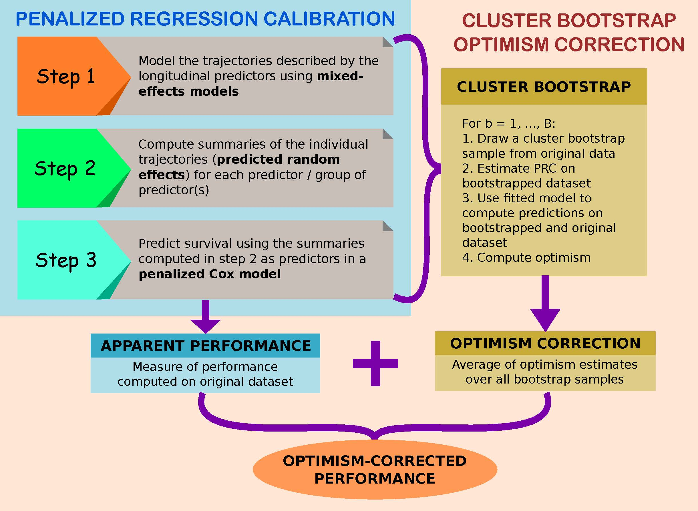

```{r, echo = F}
# CRAN limits number of available cores to 2 although it has 32
# in pencal this triggers warnings about the number of cores used
options(warn=-1)
# suppress warnings related to number of cores when rendering the vignette
```


# Introduction

## What is `pencal`?

`pencal` is an `R` package that was developed to make it easy and efficient to estimate and apply **Penalized Regression Calibration**, a statistical method proposed in [Signorelli et al. (2021)](https://doi.org/10.1002/sim.9178).

## What is Penalized Regression Calibration?

Longitudinal and high-dimensional measurements have become increasingly common in biomedical research. However, methods to predict survival outcomes using a large number of longitudinal covariates as predictors are currently missing.

Penalized Regression Calibration (PRC) is a statistical method that has been developed to fill this methodological gap, making it possible to **predict survival using as predictors a large (potentially high-dimensional) number of longitudinal covariates**.

PRC is described in detail in the following scientific article:

Signorelli, M., Spitali, P., Al-Khalili Sgyziarto, C., The Mark-MD Consortium, Tsonaka, R. (2021). [Penalized regression calibration: A method for the prediction of survival outcomes using complex longitudinal and high-dimensional data](https://doi.org/10.1002/sim.9178). Statistics in Medicine, 40 (27), 6178-6196. DOI:  [10.1002/sim.9178](https://doi.org/10.1002/sim.9178).

## How does PRC work?

In short, PRC comprises three modelling steps:

1. in the first step, we **model the trajectories described by the longitudinal covariates using mixed effects models**;

2. in the second step, we **compute subject-specific summaries of the longitudinal trajectories**. In practice, these summaries are the predicted random effects from the mixed models estimated in step 1, and they allow us to summarize the way in which the trajectories evolve over time across subjects;

3. in the third step, we **estimate a penalized Cox model** where the summaries computed in step 3 (alongside with any relevant time-independent covariate, such as baseline age, gender, ...) are employed as predictors of the survival outcome.

The final output of PRC is a penalized Cox model that allows to compute predicted survival probabilities for each individual.

Additionally, one may want to quantify the predictive performance of the fitted model. To achieve this aim, in `pencal` we have implemented a **Cluster Bootstrap Optimism Correction Procedure** (CBOCP) that can be used to obtain optimism-corrected estimates of the C index and time-dependent AUC associated to the fitted model. Depending on the dimensionality of your dataset, computing the CBOCP might be time consuming; for this reason, we offer the possibility to parallelize the CBOCP using multiple cores.

Below you can see a graphical representation of the steps involved in the estimation of PRC (see the elements in the lightblue box) and in the computation of the CBOCP (elements in the salmon box).

<p align="center">
```{r, echo = F, out.width = "650px"}

```
</p>

## Get started

Even though `pencal` is available from `CRAN`, it includes a `Bioconductor` packages among its dependencies (`survcomp`). This can create problems in the installation phase, since the usual `install.packages( )` only fetches `CRAN` dependencies, and not `Bioconductor` ones. Below I explain two alternative ways to successfully install `pencal`.

<!--
NB: the commented part is redundant now that the biocViews: fix is added
### Option 1: install Bioconductor dependencies directly

The `R` package `pencal` and all of its dependencies can be installed all in one go using:

```{r, eval=FALSE, echo=TRUE, results='asis'}
if (!require("BiocManager", quietly = TRUE))
    install.packages("BiocManager")
BiocManager::install('pencal')
```

### Option 2: install Bioconductor dependencies manually


Alternatively, you may choose to first install `survcomp` using `BiocManager::install( )`, and then to install `pencal` and all of its CRAN dependencies using `install.packages( )`. To do so, you need to use

```{r, eval=FALSE, echo=TRUE, results='asis'}
# step 1: install survcomp
if (!require("BiocManager", quietly = TRUE))
    install.packages("BiocManager")
BiocManager::install('survcomp')
# step 2: install pencal and CRAN dependencies
install.packages('pencal')
```
-->

## Installing and loading the package

To use `pencal`, you first need to install it from `CRAN` using

```{r, eval=FALSE, echo=TRUE, results='asis'}
install.packages('pencal')
```

Then, you can load the package with

```{r, eval=TRUE, echo=TRUE, results='asis'}
library(pencal)
```

# Overview of the functionalities of `pencal`

Currently, `pencal` contains functions to estimate the PRC-LMM and PRC-MLPMM models proposed in [Signorelli et al. (2021)](https://doi.org/10.1002/sim.9178). An overview of the different functions is presented in the following subsections.

## Model estimation and prediction

Estimation of the PRC-LMM model can be performed by running sequentially the following three functions:

1. `fit_lmms`, which implements the first step of the estimation of the PRC-LMM;
2. `summarize_lmms`, which carries out the second step;
3. `fit_prclmm`, which performs the third step.

As already mentioned, these functions have to be run sequentially, with the output of `fit_lmms` used as input for `summarize_lmms`, and the output of `summarize_lmms` as input for `fit_prclmm`.

Similarly, estimation of the PRC-MLPMM model can be performed using:

1. `fit_mlpmms`, which implements the first step of the estimation of the PRC-MLPMM;
2. `summarize_mlpmms`, which carries out the second step;
3. `fit_prcmlpmpm`, which performs the third step.

## Predicted survival probabilities

Computation of the predicted survival probabilities from the PRC-LMM and PRC-MLPMM models can be done with the functions `survpred_prclmm` and `survpred_prcmlpmm`.

## Predictive performance and cluster bootstrap optimism correction procedure (CBOCP)

The evaluation of the predicted performance of the estimated PRC-LMM and PRC-MLPMM can be done using the function `performance_prc`, which returns the naive and optimism-corrected estimates of the time-dependent AUC (tdAUC), C index and time-dependent Brier score. The optimism-corrected estimates are based on the CBOCP proposed in [Signorelli et al. (2021)](https://doi.org/10.1002/sim.9178).

A technical note on how the CBOCP is implemented in `pencal`: most of the computations required by the CBOCP are performed by `fit_lmms`, `summarize_lmms` and `fit_prclmm` for the PRC-LMM, and by `fit_mlpmms`, `summarize_mlpmms` and `fit_prcmlpmm` for the PRC-MLPMM. Such computations may be time-consuming, and for this reason these functions are designed to work with parallel computing (this can be easily done by setting the argument `n.cores` to a value $> 1$). The last step of the CBOCP is performed by the function `performance_prc`, which aggregates the outputs of the previous functions and computes the naive and optimism-corrected estimates of the tdAUC, C index and Brier score.

**Important note**: if you just want to estimate the PRC model, and you do not wish to compute the CBOCP, simply set `n.boots = 0` as argument of `fit_lmms`. If, instead, you do want to compute the CBOCP, set `n.boots` equal to the desired number of bootstrap samples (e.g., 100).

## Further functions

In addition to the functions mentioned above, `pencal` comprises also 3 functions that can be used to simulate example datasets:

* `simulate_t_weibull` to simulate survival data from a Weibull model;
* `simulate_prclmm_data` to simulate an example dataset for PRC-LMM that is comprehensive of a number of longitudinal biomarkers, a survival outcome and a censoring indicator;
* `simulate_prcmlpmm_data` to simulate an example dataset for PRC-MLPMM;
* `pencox_baseline` and `performance_pencox_baseline` to estimate a penalized Cox model with baseline predictors only (no longitudinal information used for prediction).

# A step by step example

To illustrate how `pencal` works, let us simulate an example dataset from the PRC-LMM model. Hereafter we generate a dataset that comprises $n = 100$ subjects, $p = 10$ longitudinal biomarkers that are measured at $t = 0, 0.2, 0.5, 1, 1.5, 2$ years from baseline, and a survival outcome that is associated with 5 (`p.relev`) of the 10 biomarkers:

```{r simulate, cache = F}
set.seed(1234)
p = 10
simdata = simulate_prclmm_data(n = 100, p = p, p.relev = 5, 
                               lambda = 0.2, nu = 1.5,
                               seed = 1234, t.values = c(0, 0.2, 0.5, 1, 1.5, 2))
ls(simdata)
```

Note that in this example we are setting $n > p$, but `pencal` can handle both low-dimensional ($n > p$) and high-dimensional ($n \leq p$) datasets.

## Input data

In order to estimate the PRC-LMM, you need to **provide the following two inputs**:

1. **a dataset in long format**, which should contain (at least) the following variables: a subject identifier that should be named `id`, the longitudinal biomarkers (here called `marker1`, ..., `marker10`), and the relevant time variables (in this example we will use `age` as covariate in the LMMs estimated in step 1, and `baseline.age` as covariate in the penalized Cox model estimated in step 3):

```{r view_longdata, fig.height=4, fig.width=5}
# view the dataset in long format
head(simdata$long.data)
# visualize the trajectories for a randomly picked biomarker
# (the code in the if statement below relies on the ptmixed package)
if ('ptmixed' %in% rownames(installed.packages())) {
  library(ptmixed)
  ptmixed::make.spaghetti(x = age, y = marker5, 
               id = id, group = id,
               data = simdata$long.data, 
               margins = c(4, 4, 2, 2),
               legend.inset = - 1)
}

```

2. **a dataset with information on the survival outcome**, which should contain (at least) the following variables: a subject identifier that should be named `id`, the time to event outcome called `time`, and the binary event indicator called `event` (NB: make sure that the variable names associated to these three variables are indeed `id`, `time` and `event`!)

```{r view_survdata, fig.height=4.5, fig.width=4}
# view the dataset with the survival data
head(simdata$surv.data)
# what is the proportion of censoring in this dataset?
simdata$censoring.prop
# visualize an estimate of the survival function
library(survival)
library(survminer)
surv.obj = survival::Surv(time = simdata$surv.data$time, 
                event = simdata$surv.data$event)
kaplan = survival::survfit(surv.obj ~ 1,  
                  type="kaplan-meier")
survminer::ggsurvplot(kaplan, data = simdata$surv.data)
```

## Some remarks on parallel computing with `pencal`

Before we begin to estimate the PRC-LMM, let's determine the number of cores that will be used for the computation of the CBOCP. In general you can use as many cores as available to you; to do this, you can set

```{r, eval=F}
n.cores = parallel::detectCores()
```

Since the [CRAN Repository Policy](https://cran.r-project.org/web/packages/policies.html) allow us to use at most 2 cores when building the vignettes, in this example we will limit the number of cores used to 2:

```{r}
n.cores = 2
```

Be aware, however, that **using more than 2 cores will speed computations up, and it is thus recommended**. Several functions in `pencal` will actually return a warning when you perform computations using less cores than available: the goal of such warnings is to remind you that you could use more cores to speed computations up; however, if you are purposedly using a smaller number of cores you can ignore the warning.

## Estimation of the PRC-LMM

Hereafter we show how to implement the three steps involved in the estimation of the PRC-LMM, alongside with the computation of the CBOCP.

### Step 1

In the first step, for each biomarker we estimate a **linear mixed model** (LMM) where the longitudinal biomarker levels $y_{ij}$ depend on two fixed effects (one intercept, $\beta_0$ and one slope for age, $\beta_1$), on a subject-specific random intercept $u_{0i}$ and on a random slope for age $u_{1i}$:

$$y_{ij} = \beta_0 + u_{0i} + \beta_1 a_{ij} + u_{1i} a_{ij} + \varepsilon_{ij}.$$

To do this in `R` we use the `fit_lmms` function:

```{r step1, cache = F}
y.names = paste('marker', 1:p, sep = '')
step1 = fit_lmms(y.names = y.names, 
                 fixefs = ~ age, ranefs = ~ age | id, 
                 long.data = simdata$long.data, 
                 surv.data = simdata$surv.data,
                 t.from.base = t.from.base,
                 n.boots = 10, n.cores = n.cores)
```

The LMM fitted here is just an example of how to model longitudinal biomarker trajectories: depending on the data you are dealing with, you may choose to specify different fixed and random effects formulas, or even to consider the MLPMM instead of the LMM.

Note that here I have set `n.boots = 10` to reduce computing time for the CBOCP, given that CRAN only allows me to use two cores when compiling the vignette. In general, it is recommended to set `n.boots = 0` if you do not wish to compute the CBOCP, or to set `n.boots` equal to a larger number (e.g., 50, 100 or 200) if you want to accurately compute the CBOCP. In the latter case, consider using as many cores as available to you to speed computations up.

`fit_lmms` returns as output a list with several elements; among them is `lmm.fits.orig`, which contains the LMMs fitted to each biomarker:

```{r}
ls(step1)
# estimated LMM for marker1:
step1$lmm.fits.orig[1]
```

A useful helper function to inspect the parameter estimates from the LMMs is the `getlmm` function:

```{r}
getlmm(step1, 'marker3', 'betas')
getlmm(step1, 'marker3', 'tTable')
getlmm(step1, 'marker3', 'variances')
```


For more details about the arguments of `fit_lmms` and its outputs, see the help pages: `?fit_lmms` and `getlmm`.

### Step 2

In the second step we **compute the predicted random intercepts and random slopes** for the LMMs fitted in step 1:

```{r step2, cache = F}
step2 = summarize_lmms(object = step1, n.cores = n.cores)
```

`summarize_lmms` returns as output a list that contains, among other elements, a matrix `ranef.orig` with the predicted random effects for the LMMs fitted in step 1:

```{r}
ls(step2)
# view predicted random effects for the first two markers
step2$ranef.orig[1:5, 1:4]
```

For more details about the arguments of `summarize_lmms` and its outputs, see the help page: `?summarize_lmms`.

### Step 3

Lastly, in the third step of PRC-LMM we estimate a **penalized Cox model** where we employ as predictors baseline age and all the summaries (predicted random effects) computed in step 2:

```{r step3, cache = F}
step3 = fit_prclmm(object = step2, surv.data = simdata$surv.data,
                   baseline.covs = ~ baseline.age,
                   penalty = 'ridge', n.cores = n.cores)
```

In this example I have set `penalty = 'ridge'`, but you may also use elasticnet or lasso as alternatives. Moreover, by default the predicted random effects are standardized when included in the penalized Cox model (if you don't want to perform such standardization, set `standardize = F`).

`fit_prclmm` returns as output an object of class `prclmm` with its own `print` and `summary` methods:

```{r}
print(step3)
```

In practice, the `prclmm` object is also a list that contains, among other elements, the fitted penalized Cox model `pcox.orig`, which is a `glmnet` object:

```{r}
ls(step3)
class(step3$pcox.orig)
library(glmnet)
t(as.matrix(coef(step3$pcox.orig)))
```

For more details about the arguments of `fit_prclmm` and its outputs, see the help page: `?fit_prclmm`.

## Estimation of the PRC-MLPMM models

Estimation of the PRC-MLPMM(U) and PRC-MLPMM(U+B) models proceeds in a similar fashion. For details and examples about this multivariate approach, see: `?fit_mlpmms` (step 1), `?summarize_mlpmms` (step 2), and `?fit_prcmlpmm` (step 3).

## Predicted survival probabilities

After fitting the model, you will probably want to obtain **predicted survival probabilities** for each individual at several time points. This can be done through the function `survpred_prclmm`, which takes as inputs the outputs of step1, step 2 and step 3, alongside with the time points at which to compute the survival probabilities:

```{r}
preds = survpred_prclmm(step1, step2, step3, times = c(1, 2, 3))
ls(preds)
head(preds$predicted_survival)
```

## Cluster bootstrap optimism correction and performance measures

To accurately quantify the predicted performance of the fitted PRC model, we need to recur to some form of **internal validation** strategy (e.g., bootstrap, cross-validation, etc...).

In `pencal` the internal validation is performed through a Cluster Bootstrap Optimism Correction Procedure (CBOCP) that allows to compute **optimism-corrected estimates of the  time-dependent AUC (tdAUC), C index and time-dependent Brier score**.

Most of the steps that the CBOCP requires are directly computed by the functions `fit_lmms`, `summarize_lmms` and  `fit_prclmm` whenever the argument `n.boots` of `fit_lmms` is set equal to an integer > 0 (in other words: most of the computations needed for the CBOCP have already been performed in the code chunks executed above, so we are almost done!).

To gather the results of the CBOCP we can use the function `performance_prc`:

```{r cbocp, cache = F}
cbocp = performance_prc(step2, step3, metric = c('tdauc', 'c', 'brier'),
                        times = 1:3, n.cores = n.cores)
ls(cbocp)
# time-dependent AUC estimates:
cbocp$tdAUC
# C index estimates:
cbocp$concordance
# Brier score estimates:
cbocp$Brier
```

From the results above we can see that, for example:

* the naive tdAUC for predictions at 2 years from baseline is estimated = 0.834, and the optimism-corrected estimate is = 0.796;
* the naive C index is estimated = 0.786, and the optimism-corrected C index is estimated = 0.747;
* the naive Brier score for predictions at 1 year from baseline is estimated = 0.146, and the optimism-corrected estimate is = 0.211.

# Further details and material

The aim of this vignette is to provide a quick-start introduction to the `R` package `pencal`. Here I have focused my attention on the fundamental aspects that one needs to know to be able use the package. More details, functions and examples can be found in [the manual of the package](https://CRAN.R-project.org/package=pencal/pencal.pdf). The methodology that `pencal` relies on is described in [Signorelli et al. (2021)](https://doi.org/10.1002/sim.9178).